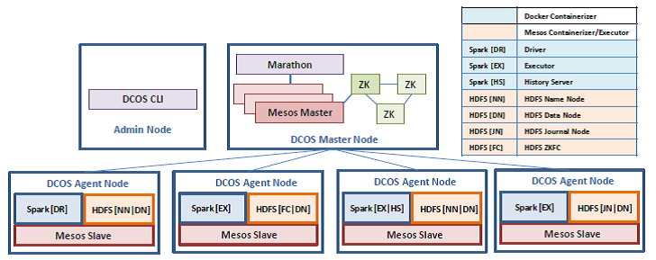

# compute-engine-spark

An implementation of [compute-engine](https://github.com/amolthacker/compute-engine) using 
[Apache Spark](http://spark.apache.org/) on [Apache Mesos](http://mesos.apache.org/) in a Docker containerized runtime 
orchestrated with [Marathon](https://mesosphere.github.io/marathon/) in a [DC/OS](https://dcos.io/) cluster in 
[ACS](https://azure.microsoft.com/en-us/services/container-service/).

The application takes as input the compute metric and no.of trades and parallelizes metric calc in the map phase and 
calculates an aggregate metric in the reduction phase of the Spark program.

It uses a [Docker image](https://hub.docker.com/r/amolthacker/dcos-spark-ql/) built with mesosphere/spark as its base with 
layers for native libraries required for the [mockvalengine](https://github.com/amolthacker/azure-poc-compute-engine-mock) and runs as 
Docker containerized Mesos tasks


## Architecture




## Provisioning on ACS

```
see dcos/az-provision.sh
```

## Running the Application

### Locally

```
$ git clone https://github.com/amolthacker/azure-poc-compute-engine-acs-spark.git

$ cd compute-engine-spark
$ mvn clean package

$ docker build -t compute-engine-spark .
$ docker run -it compute-engine-spark bash
```

### On ACS

From within AZ using DCOS CLI
```
vtasadmin@dcos-master-vtas-0:~$ dcos spark run --docker-image=amolthacker/dcos-spark-ql \
--submit-args="--master mesos://localhost/service/spark/ --conf spark.eventLog.enabled=true --conf spark.eventLog.dir=hdfs://hdfs/history --conf spark.executor.memory=4g --conf spark.executor.extraLibraryPath=/usr/local/lib --deploy-mode cluster --supervise --driver-memory 4g --driver-library-path /usr/local/lib --class com.td.veritas.valengine.spark.Valengine https://github.com/amolthacker/azure-poc-compute-engine-acs-spark/raw/master/compute-engine-spark-0.1.0.jar OptionPV 5000 50" \
--verbose
```
